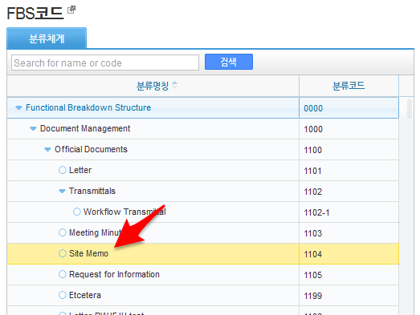
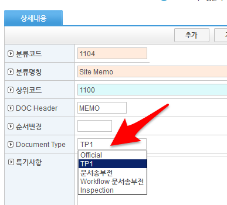

.. sectionauthor:: Emanuele Disco <emanuele.disco@gmail.com>
.. _doc-list-main-readme:

=================================== 
DocListMain_*.jsp Parameters List
===================================

Parameters definition
-----------------------

fbs_cd
	선택된 FBS 트리item

form_cd1
	FBS ROOT트리
	
form_cd2
	자료등록(도면등록) FBS ROOT트리
	
form_cd3
	검토회시 FBS

fbshide
	fbs트리 안 나옴
	
doc_type
	목록/작성된 문서구분
	 
treeview
	이력보기
	
srch_priv
	개인 문서만 나옴

type
	목록보기 구분

	ALL_ENTPRS
		업체 모든 문서 (srch_priv 개인만)
		
	ALL_PRIVATE
		개인 모든 문서
		
	ALL_PUBLIC
		모든 문서 (srch_priv 개인만)
	
	EXT_ENTPRS_INBOX
		수신문서
		
	EXT_ENTPRS_OUTBOX
		발신문서
	
	EXT_DRAFT
		개인 임시저장 문서
		
	EXT_INBOX
		수신 문서
		
	EXT_OUTBOX
		발신 문서
	
	APP_INBOX
		개인 승인 수신문서
		
	APP_OUTBOX
		승인 발신문서
	
	DOC_CREATED
		개인 작성 문서
	
	COMPLETED
		발신/수신 문서, 결재완료된 문서
		
	PENDING
		결재 진행중
	
	DIST_INBOX
		배포 수신
		
	DIST_OUTBOX
		배포 발신
	
	[empty]
		모든 문서 + 삭제된 문서 (srch_priv 개인만)
	

Main JSP Tabs
----------------------

DocListMain.jsp
	1. tab: 수신함
	2. tab: 발신함
	3. tab: 문서작성함
	
DocListMain_approval.jsp
	1. tab: 수신함
	2. tab: 발신함
	
DocListMain_cre_app.jsp
	1. tab: 개인 작성 문서
	2. tab: 개인 승인 발신문서
	
DocListMain_draft.jsp
	1. tab: 개인 임시저장 문서
	
DocListMain_manager.jsp
	1. tab: custom (type 따라)
	
	
Document Type ( FBS Setting )
--------------------------------

.. important:: It's important to choose the correct document type associated to the fbs.
	If the user change the document type (FBS), the document change 
	in accordance with the fbs type choosen. 

Select the fbs from the list

Choose the type of document associated with this fbs

