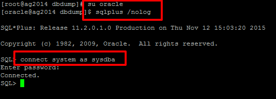

.. _howto-oracledb-user-import&export:

How to import and export Oracle user between servers
=======================================================

1. Problem
----------------

1. ``Server 1``: Is the server where we will take the Oracle user dump file from.
2. ``Server 2``: Is the server we need to copy the user to.

We need to copy the schema/user ``YRP`` from the server ``Server 1`` to the server ``Server 2`` 
and this user has two tablespace associated, ``YRP`` and ``RWJEJU`` (we need to fix it).

2. Download dump file from ``Server 1`` to ``Server 2``
---------------------------------------------------------

2.1 Open a terminal on Server 2

2.2 Go to the dbdump folder

2.3 Check the name of the dump to download from ``Server 1``

2.4 Download the dump with scp from Server 2

3. Extract the dmp file from the archive file
----------------------------------------------------------

Extract the file inside the archive using the command ``tar``

.. image:: _images/odb_io/sc5.png

4. Check tablespaces associated with the user in order to fix them later
--------------------------------------------------------------------------

.. important:: 
	If more than one tablespace is present, these tablespaces have to be remapped during the import procedure (see below). 

5. Create new user and tablespace on ``Server 2``
-----------------------------------------------------

5.1 Connect ``oracle`` user and login with sqlplus

5.2 Check the folder that contains tablespace files in order to create the new tablespace in the correct folder

5.3 Create tablespace and user to ``Server 2``

5.4 Check if it is possible to connect to the user from remote (sql developer)

6. Import the dump file to ``Server 2``
-------------------------------------------

6.1 Check the dump folder before executing the command ``impdp``

6.2 Start the import procedure

Execute the following command from the terminal

We have to remap two tablespace:

1. ``YRP`` -> ``YSG``
2. ``RWJEJU`` -> ``YSG``

and a schema: ``YRP`` -> ``YSG``

::

	$ impdp system/[PWD] \
	> remap_tablespace=YRP:YSG,RWJEJU:YSG \
	> remap_schema=YRP:YSG \
	> directory=DATA_PUMP_DIR dumpfile=[dmp file here] \
	> exclude=STATISTICS

Done!

