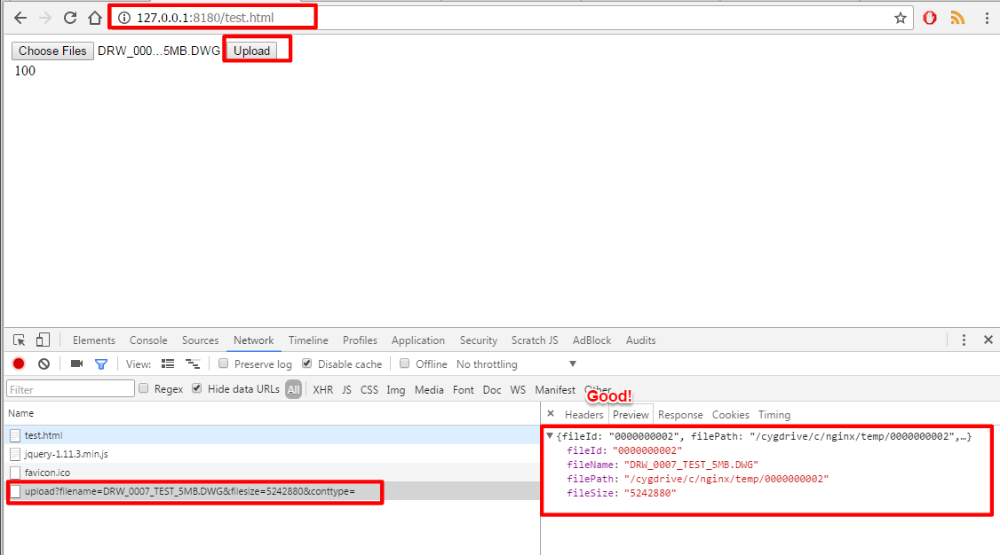
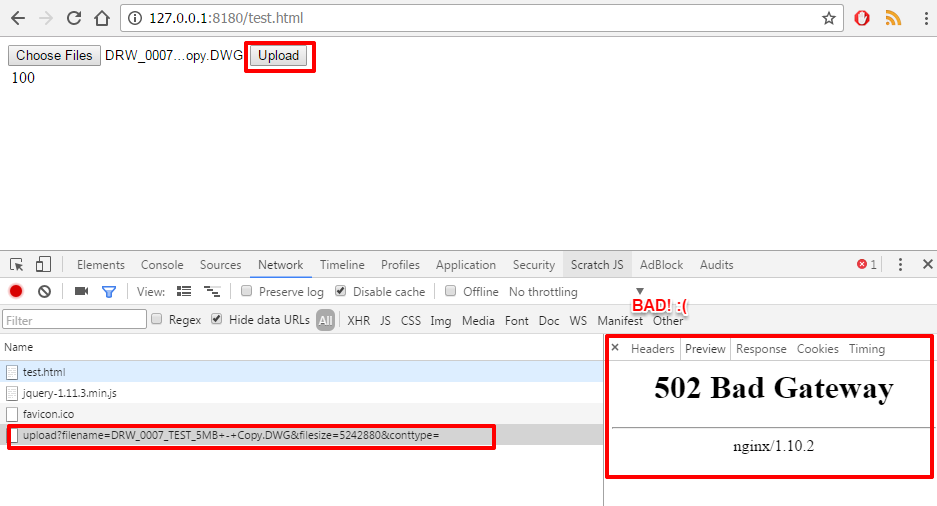

.. highlight:: bash

.. _nginx-file-upload-handler-windows:

===============================================================
[For Windows] Nginx File Upload Handler Install & Configuration
===============================================================

About Nginx
	https://www.nginx.com/resources/wiki/start/topics/tutorials/gettingstarted/

.. important:: 
	
	Make sure the **Nginx temporary folder** is the **same** used by the web application ( properties ``upload.temp`` )
	to prevent lots of waste of space and other issues...

--------------------------

1. Download and Copy Nginx
----------------------------

Take the nginx folder from one of these links below: 

- SVN Repository http://125.141.221.126/repo/STND_PMIS_util/nginx.zip
- SangAh Cloud http://dev.sangah.com/owncloud/index.php/s/nim9D8CUaH1q3uv

Copy the folder on the server, and put the folder just below the root of the drive (ex. c:\nginx)
to prevent to make mistakes with the path later.

2. Nginx Settings
---------------------------

Supposing the nginx folder is located at ``C:/nginx`` we need to change some paths inside
some configuration files.
	
Locate the file ``conf/sites-enabled/upload.conf`` 
and fix the following line where you see the drive letter with the correct path to nginx folder::

	fastcgi_param   SCRIPT_FILENAME  c:/nginx/html$fastcgi_script_name;

Locate the file ``start-nginx.bat`` inside the nginx folder and fix the following lines::

	SET NGINX_HOME=c:\nginx
	%NGINX_EXE% -p /cygdrive/c/nginx/

You should need to change only the drive letter here.
Just make sure you put ``nginx`` folder right under the root of the drive (ex. c:/nginx).

.. warning:: 
  **Don't change the path /cygdrive/ !** only the drive letter.

.. note:: 
	All the temporary files will go under the folder ``temp`` inside the nginx root folder.

	**Replace the folder temp with a symbolic link to the web application temporary folder** 
	so the folder is cleaned up when 'cleanup' task is executed by the web application.

3. [OLD] Install Nginx Service
---------------------------------

.. warning:: Doesn't work anymore skip to step 4.

Open a shell go to the nginx folder and type the following::

	> nginx-service.cmd install
	
This should install a Windows Service for the Nginx Upload Service with the name
``Nginx File Upload Handler``.

4. Start & Stop script
----------------------------------------------

You can start and stop the service with the following executables:

**start-nginx.bat**
	Start the service Nginx + PHP

**stop-nginx.bat**
	Stop the service Nginx + PHP

Create a schedule to start the service automatically from the Task Scheduler, 
just follow the steps below:

Open the Task Scheduler using the application ``taskschd.msc``. Then create a new task:

	.. figure:: _images/nginx/f1.png

	.. figure:: _images/nginx/f2.png

	.. figure:: _images/nginx/f3.png

	.. figure:: _images/nginx/f4.png

	.. figure:: _images/nginx/f5.png

5. Test Nginx Up and Running
------------------------------

Start the service by running the schedule you created:

	.. figure:: _images/nginx/f11.png

Test if nginx server is running executing ``nginx-status.cmd`` from the nginx folder.

You should see an output like this::

	C:\nginx-1.8.1>tasklist /fi "imagename eq nginx.exe"

	Image Name                     PID Session Name        Session#    Mem Usage
	========================= ======== ================ =========== ============
	nginx.exe                     6296 Services                   0      7,808 K
	nginx.exe                     6284 Services                   0      8,116 K
	nginx.exe                     8224 Services                   0      8,132 K

	C:\nginx-1.8.1>PAUSE
	Press any key to continue . . .

6. Test Upload Service
------------------------

You can test the upload service using a test page from the following address:

**http://127.0.0.1:8180/test.html**

From here just upload a file and check the response 
making sure it return a json result with the temporary file information.

*If the service is running fine*

*If the service is not running or there is some problems*

*Check if the file has been created*

7. Restart On Crash
------------------------

In case nginx service or PHP service go down we need to start again these services as soon as possible
to prevent to many problems.

The application we are going to use is RestartOnCrash.exe inside ``nginx/etc/roc`` folder.
We install the application as as service so it will start automatically on windows startup.

.. note:: The application monitor nginx and php services and if they go down they will be restarted automatically.

Open a terminal **as administrator** and go to the folder ``roc`` where is located the executable
``RestartOnCrash.exe``, from there type::

	> roc-service.exe install
	
*The application installed as a service*

	.. figure:: _images/nginx/f9.png

The service will be installed and you can start it from the Services panel of Windows or by typing::

	> roc-service.exe start

Check that the application is running looking at the Start Task Manager of Windows

	.. figure:: _images/nginx/f10.png

-------------

Apache and Project Settings
^^^^^^^^^^^^^^^^^^^^^^^^^^^^

1. Apache Proxy Settings
--------------------------

.. important::

	Make sure the modules ``proxy_module`` and ``proxy_http_module`` are installed before continuing.

	Verify the following directives are present inside the main Apache configuration file::
		
		LoadModule proxy_module modules/mod_proxy.so
		LoadModule proxy_http_module modules/mod_proxy_http.so
		
		

Add the following Proxy configuration to the Apache VirtualHost::

	<VirtualHost *:80>
	ServerAdmin webmaster@dummy-host.example.com
	...

	# FILE UPLOAD HANDLER
	<LocationMatch '/upload'>
		<IfModule security2_module>
			SecRuleEngine Off
		</IfModule>

		ProxyPass "http://127.0.0.1:8180/upload"
		ProxyPassReverse "http://127.0.0.1:8180/upload"
	</LocationMatch>

	
.. important::
	**NOT REQUIRED ANYMORE IF USING PHP REQUEST**

	Because the file handler need to do a request on http://127.0.0.1/Common/TemporaryFile/fastupload.action
	we need to add the following default jkMount to the default VirtualHost if it is present::

		# default host
		<VirtualHost _default_:80>
			ServerName 127.0.0.1
			DocumentRoot "/tmp"

			...

			# [IMPORTANT] nginx file upload result handler
			jkMount /Common/TemporaryFile/* worker1

		</VirtualHost>
	
	Change the ``worker1`` with the actual one used on the server.
	
.. important:: 
	
	There is a problem on big file upload with the following error::
	
		[error] (103)Software caused connection abort: proxy: pass request body failed to 127.0.0.1:50000 (127.0.0.1)                                                                           
		[error] proxy: pass request body failed to 127.0.0.1:50000 (127.0.0.1) from 1.1.1.1.1 ()

	To resolve this error add the following directives inside the Apache configuration file::
	
		SetEnv proxy-sendchunked 1
		SetEnv proxy-sendchunks 1
		SetEnv downgrade-1.0 1
		SetEnv proxy-sendcl 1

2. Final Project Setting
--------------------------

Remember to add the following property to the project system configuration file::

	system.upload.handler=nginx
	

Restart the application and do some upload test on WebHard.