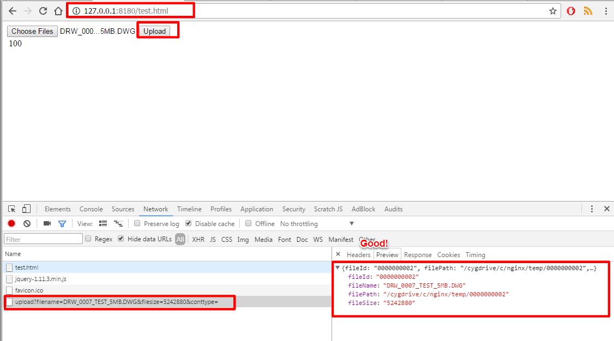

.. highlight:: bash

.. _nginx-file-upload-handler:

==================================================
Nginx File Upload Handler Install & Configuration
==================================================

About Nginx
	https://www.nginx.com/resources/wiki/start/topics/tutorials/gettingstarted/

.. important:: 
	
	Make sure the **Nginx temporary folder** is the **same** used by the web application ( properties ``upload.temp`` )
	to prevent lots of waste of space and other issues...

--------------------------

On Linux Machine
^^^^^^^^^^^^^^^^^^^^^

1. Download nginx
------------------

Go `here <http://nginx.org/en/download.html>`_ for the latest version or...

Version 1.8 -> http://nginx.org/download/nginx-1.8.1.tar.gz

::

	cd ~
	wget http://nginx.org/download/nginx-1.8.1.tar.gz

2. Extract the archive
------------------------

Extract the nginx archive where you want with::

	tar -xvf nginx-1.8.1.tar.gz

3. Install the required libraries
-----------------------------------

For Centos::

	sudo yum install -y httpd-devel httpd-tools pcre perl pcre-devel zlib zlib-devel openssl-devel

For Ubuntu::

	sudo apt-get install libpcre3-dev zlib1g-dev libssl-dev make apache2-utils

4. Compile & Install
-------------------------- 

Execute the following commands in sequence inside the nginx folder::

	./configure \
	--user=nginx                          \
	--group=nginx                         \
	--prefix=/etc/nginx                   \
	--sbin-path=/usr/sbin/nginx           \
	--conf-path=/etc/nginx/nginx.conf     \
	--pid-path=/var/run/nginx.pid         \
	--lock-path=/var/run/nginx.lock       \
	--error-log-path=/var/log/nginx/error.log \
	--http-log-path=/var/log/nginx/access.log \
	--with-http_gzip_static_module        \
	--with-http_stub_status_module        \
	--with-http_ssl_module                \
	--with-pcre                           \
	--with-file-aio                       \
	--with-http_realip_module

	make
	sudo make install

5. Auto Configure
------------------- 

Now that Nginx is installed we need to configure the file upload handler. 
We need to execute a script that will do some configuration for us.
 
From this `repository <https://github.com/emawind84/nginx-upload-handler-conf.git>`_ take the following file::

	sudo wget https://raw.githubusercontent.com/emawind84/nginx-upload-handler-conf/master/nginx_configure.sh \
	-O /etc/nginx/configure.sh

Let's execute the script::

	cd /etc/nginx
	sudo chmod +x configure.sh
	sudo ./configure

This script should grab several files from the repository, test the configuration for errors
and test a file upload on the server. If everything is ok you should see some instructions
for starting, stopping and reloading nginx.::

	...
	nginx: [warn] duplicate MIME type "text/html" in /etc/nginx/nginx.conf:40
	nginx: the configuration file /etc/nginx/nginx.conf syntax is ok
	nginx: configuration file /etc/nginx/nginx.conf test is successful
	Starting nginx server...
	nginx: [warn] duplicate MIME type "text/html" in /etc/nginx/nginx.conf:40
	https://www.nginx.com/resources/wiki/start/topics/tutorials/commandline/
	Start nginx using: nginx
	Reload nginx using: nginx -s reload
	Stop nginx using: nginx -s stop

6. Test
------------

Check that the handler is working with the following commands::

	$ sudo dd if=/dev/zero of=/tmp/test.tmp bs=512k count=1 >/dev/null 2>&1
	$ sudo curl --user ngxupload:ngxupload --data-binary '@/tmp/test.tmp' http://127.0.0.1:8180/upload

	{"fileId":"0046678708","fileEdmsId":"","filePath":"/tmp/0046678708","contentType":"application/octet-stream;charset=UTF-8"}

--------------------------

	
On Windows Machine
^^^^^^^^^^^^^^^^^^^^^

1. Download and Copy Nginx
----------------------------

| Take the nginx folder from the SVN `here <http://125.141.221.126/repo/STND_PMIS_util/nginx.zip>`_
| Or from the owncloud website `here <http://dev.sangah.com/owncloud/index.php/s/nim9D8CUaH1q3uv>`_

Copy the folder on the server, and make sure it is just below the root of the drive (ex. c:\nginx).

2. Settings Nginx
---------------------------

Supposing the nginx folder is located at ``C:/nginx`` we need to change some paths inside
some configuration files.
	
Locate the file ``conf/sites-enabled/upload.conf`` 
and fix the following line where you see the drive letter with the correct path to nginx folder::

	fastcgi_param   SCRIPT_FILENAME  c:/nginx/html$fastcgi_script_name;

Locate the file ``start-nginx.bat`` inside the nginx folder and fix the following lines::

	SET NGINX_HOME=c:\nginx
	%NGINX_EXE% -p /cygdrive/c/nginx/

You should need to change only the drive letter here.
Just make sure you put ``nginx`` folder right under the root of the drive (ex. c:/nginx).

.. warning:: 
  **Don't change the path /cygdrive/ !**

.. note:: 
	All the temporary files will go under the folder ``temp`` inside the nginx root folder.

	**Replace the folder temp with a symbolic link to the web application temporary folder** 
	so the folder is cleaned up when 'cleanup' task is executed by the web application.

3. OLD Install Nginx Service
--------------------------

.. warning:: Doesn't work anymore.

Open a shell go to the nginx folder and type the following::

	> nginx-service.cmd install
	
This should install a Windows Service for the Nginx Upload Service with the name
``Nginx File Upload Handler``.

4. Start & Stop script
----------------------------------------------

You can start and stop the service with the following executables::

	> start-nginx.bat
	> stop-nginx.bat
	
To start the service automatically create a Task in the Task Scheduler:

5. Test Nginx Up and Running
------------------------------

Test if nginx server is running executing ``nginx-status.cmd`` from the nginx folder.

You should see an output like this::

	C:\nginx-1.8.1>tasklist /fi "imagename eq nginx.exe"

	Image Name                     PID Session Name        Session#    Mem Usage
	========================= ======== ================ =========== ============
	nginx.exe                     6296 Services                   0      7,808 K
	nginx.exe                     6284 Services                   0      8,116 K
	nginx.exe                     8224 Services                   0      8,132 K

	C:\nginx-1.8.1>PAUSE
	Press any key to continue . . .

6. Test Upload Service
------------------------

You can test upload service going with a browser to the following address:

**http://127.0.0.1:8180/test.html**

From here just upload a file and check the response 
making sure it return a json result with the temporary file information.

If the service is running fine:

If the PHP service is not running:

.. figure:: _images/nginx/f7.png

Check if the file has been created:

.. figure:: _images/nginx/f8.png

-------------

Apache and Project Settings
^^^^^^^^^^^^^^^^^^^^^^^^^^^^

1. Apache Proxy Settings
--------------------------

.. important::

	Make sure the modules ``proxy_module`` and ``proxy_http_module`` are installed before continuing.

	Verify the following directives are present inside the main Apache configuration file::
		
		LoadModule proxy_module modules/mod_proxy.so
		LoadModule proxy_http_module modules/mod_proxy_http.so
		
		

Add the following Proxy configuration to the Apache VirtualHost::

	<VirtualHost *:80>
	ServerAdmin webmaster@dummy-host.example.com
	...

	# FILE UPLOAD HANDLER
	<LocationMatch '/upload'>
		<IfModule security2_module>
			SecRuleEngine Off
		</IfModule>

		ProxyPass "http://127.0.0.1:8180/upload"
		ProxyPassReverse "http://127.0.0.1:8180/upload"
	</LocationMatch>

	
.. important::
	**NOT REQUIRED ANYMORE IF USING PHP REQUEST**

	Because the file handler need to do a request on http://127.0.0.1/Common/TemporaryFile/fastupload.action
	we need to add the following default jkMount to the default VirtualHost if it is present::

		# default host
		<VirtualHost _default_:80>
			ServerName 127.0.0.1
			DocumentRoot "/tmp"

			...

			# [IMPORTANT] nginx file upload result handler
			jkMount /Common/TemporaryFile/* worker1

		</VirtualHost>
	
	Change the ``worker1`` with the actual one used on the server.
	
.. important:: 
	
	There is a problem on big file upload with the following error::
	
		[error] (103)Software caused connection abort: proxy: pass request body failed to 127.0.0.1:50000 (127.0.0.1)                                                                           
		[error] proxy: pass request body failed to 127.0.0.1:50000 (127.0.0.1) from 1.1.1.1.1 ()

	To resolve this error add the following directives inside the Apache configuration file::
	
		SetEnv proxy-sendchunked 1
		SetEnv proxy-sendchunks 1
		SetEnv downgrade-1.0 1
		SetEnv proxy-sendcl 1

2. Final Project Setting
--------------------------

Remember to add the following property to the project system configuration file::

	system.upload.handler=nginx
	

Restart the application and do some upload test on WebHard.