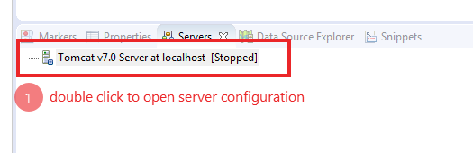
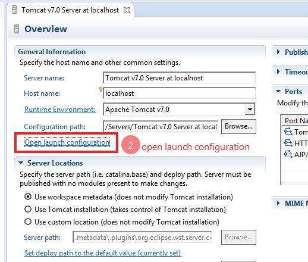
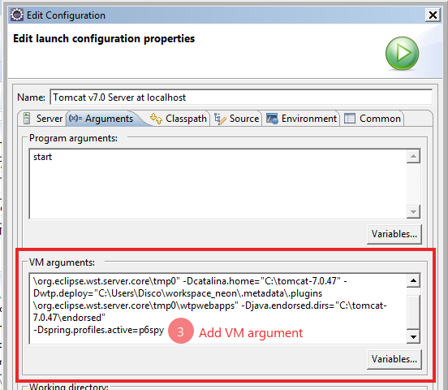

PMIS JDBC Logging with p6spy
=================================

log4sql can't be used on the new PMIS so we moved on p6spy.
In order to see sql log, we need to activate a spring profile ``p6spy``.

1. Create the server and double click the server name to go to the setting page.
------------------------------------------------------------------------------------------------

2. Click *Open launch configuration*
------------------------------------------------

3. Add the following VM argument to the list
------------------------------------------------------------

  ::

    -Dspring.profiles.active=p6spy

  If other profiles are already active just append ``p6spy`` separated by comma.

.. seealso:: 
    Learn more on Spring Profiles `here <https://docs.spring.io/spring-boot/docs/current/reference/html/howto-properties-and-configuration.html>`_