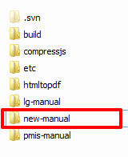

.. _pmis-manual-howto:

How to Install and Update PMIS Manual with Sphinx
====================================================

.. note:: The server ``203.239.21.121`` is used for testing and building the manual.

Create and Build the Manual
-----------------------------

From the server 121 go to the home directory::

	> cd ~
	
Create the folder that will contain the manual::

	> mkdir rwjeju-manual
	
Copy one of the manual already present::

	> cd ~
	> cp -R pmis-manual/* rwjeju-manual
	
Now the new manual is ready to be built. Type the following to build the manual::

	> cd rwjeju-manual
	> cd doc_ko/setup
	> ./devnote.sh build
	
	Doc folder: ../
	Python env folder: python
	Package manager: apt-get
	Current folder: /home/sangah/rwjeju-manual/doc/setup
	...
	Build finished. The HTML pages are in _build/html.
	Deactivating Python environment...
	Script terminated.

	
If the following output come out the process is complete and ready to be used and tested.

But if you have the following result::

	...
	Current folder: /home/sangah/rwjeju-manual/doc/setup
	Activating Python environment...
	./devnote.sh: 줄 108: python/bin/activate: 그런 파일이나 디렉터리가 없습니다
	
you need to install python environment first.

To install the python environment type the following from the setup folder::

	> ./devnote.sh install
	
	...
	Collecting pytz>=0a (from babel>=1.3->sphinx)
	Downloading pytz-2015.6-py2.py3-none-any.whl (475kB)
		100% |████████████████████████████████| 475kB 68kB/s
	Collecting MarkupSafe (from Jinja2>=2.3->sphinx)
	Installing collected packages: sphinx-rtd-theme, snowballstemmer, six, Pygments, docutils, pytz, babel, MarkupSafe, Jinja2, alabaster, sphinx
	Successfully installed Jinja2-2.8 MarkupSafe-0.23 Pygments-2.0.2 alabaster-0.7.6 babel-2.1.1 docutils-0.12 pytz-2015.6 six-1.10.0 snowballstemmer-1.2.0 sphinx-1.3.1 sphinx-rtd-theme-0.1.9
	Environment installed, documentation ready to build!

After you receive the following result and the environment is installed 
you can type the previous command to build the manual.

The manual will be built in the folder ``_build/html``, type the following and take a look inside the folder::

	> cd ~
	> cd rwjeju-manual/doc_ko/_build/html
	
To use the manual and test it apache need to be configured first.::

	> cd /etc/apache2/sites-available
	> vi pmis-manual.conf
	
You need to edit the ``pmis-manual.conf``. Just add the following settings to the file::
	
	Alias /ko/rwjj-manual /home/sangah/rwjeju-manual/doc_ko/_build/html 
	
	<Directory /home/sangah/rwjeju-manual/doc_ko/_build/html >
	Options FollowSymLinks
	AllowOverride None
	Require all granted
	</Directory>

Reload the apache service::

	> sudo service apache2 reload
	
You need to add these lines for every language you need.
After you reload the apache conf, the manual will be accessible from the url ``http://dev.sangah.com/ko/rwjj-manual``

Edit and Test the Manual
---------------------------

The manual will be edited on a local computer and deployed on the server for the building process.
The folder that need to be used is in the SVN inside the folder ``STND_PMIS_util`` under the name ``new-manual``.

Give the folder to the people that will make the manual!

Befire doing that you need to edit the following files::

	build.cmd
	rebuild.cmd
	
Change the two variables inside as needed::

	SET LANG=ko
	SET MANUAL_HOME=/home/sangah/rwjeju-manual
	
For every language just make a copy of these two files and change the two variables accordingly.
For the japanese version::

	buld_ja.cmd
	rebuild_ja.cmd
	
	SET LANG=ja
	SET MANUAL_HOME=/home/sangah/rwjeju-manual
	
The people who make the manual will execute one of these files to deploy the manual on the server and build it.

Save the Manual on the SVN
-------------------------------

When the editor has finished to edit the manual, it should be saved on our SVN.

1. First download on your computer the folder STND_PMIS_util from the SVN.

2. Open the server with WinSCP and go to the folder of the manual.

	.. image:: _images/pmis-manual_4.png

3. Make a new folder inside STND_PMIS_util. For example ``rwjj-manual``.

4. You should have a filter with the following exceptions set, in order to copy only the required files.

	.. image:: _images/pmis-manual_3.png

5. Copy all the doc folders in your new local folder ``rwjj-manual``. 
   Make sure the options are set correctly.

	.. image:: _images/pmis-manual_2.png

6. Commit and you are done.