.. _web-app-maven-and-eclipse:

=====================================
Web Application + Maven + Eclipse
=====================================

To make use of Maven and still test our application with Eclipse Tomcat Server module,
we need to add to the application the web module in order to add our application to the Server without much effort.

1. Project Facets Settings
------------------------------

Here we need to add the web module to the application so to add the application later on the server.

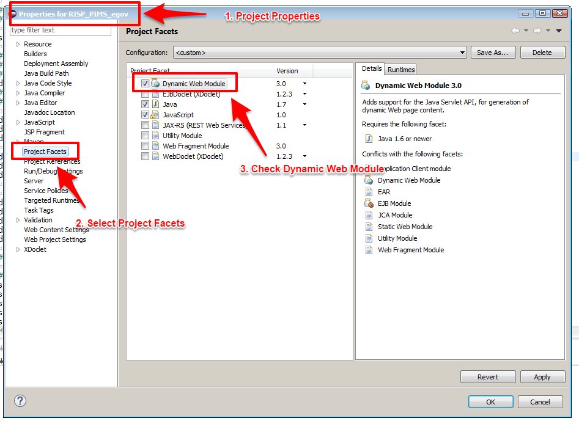

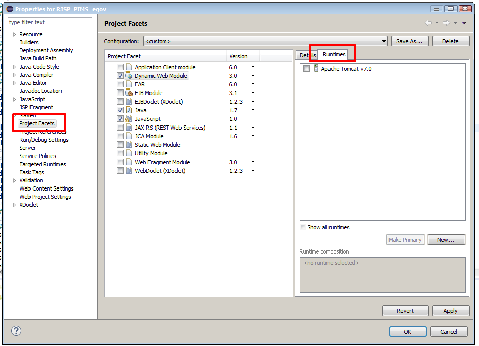

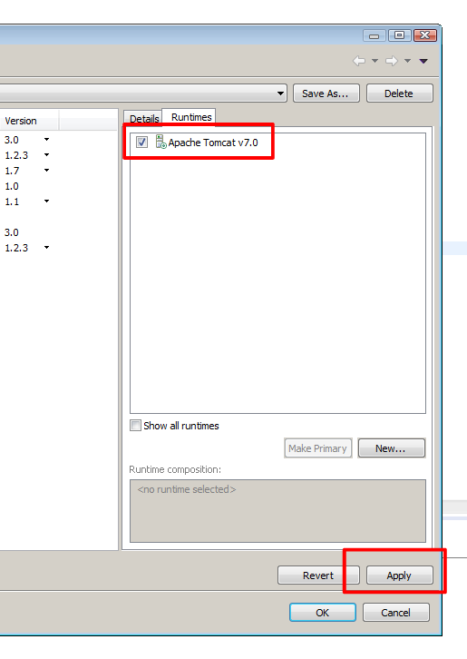

2. Deployment Assembly
-----------------------------

We need to change the path to the web folder.
By default Eclipse will look for ``WebContent`` folder we need to change it to ``web``.

.. note:: Delete the WebContent from the source too!

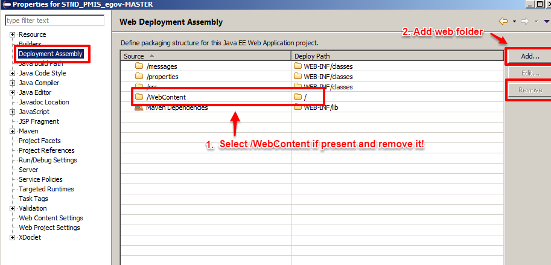

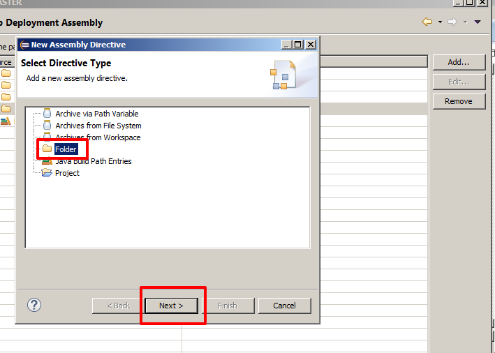

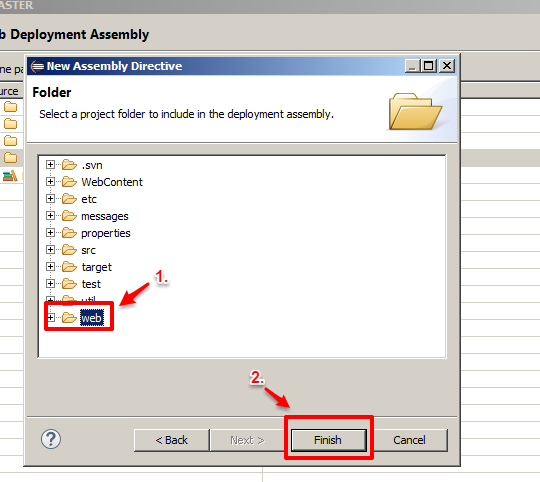

.. note:: Make sure that the folder **web** and **Maven Dependencies** are present like in the picture below!

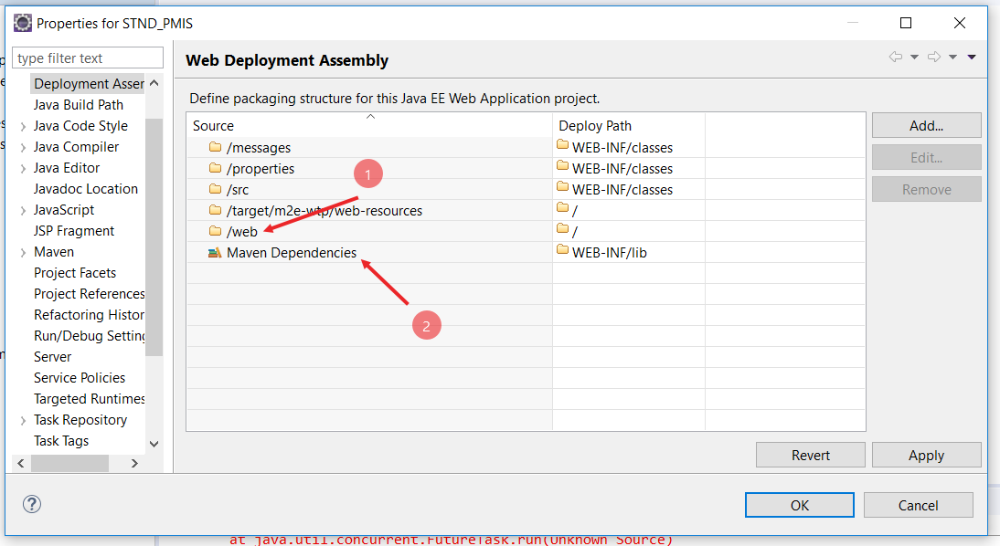

.. important::
  If **Maven Dependencies** doesn't show in the list you need to update the Maven plugin, 
  (right click on the project folder and from the menu **Maven** -> **Update Project...**).

  .. figure:: _images/eclipse-webapp/ice_screenshot_20171116-174640.png

3. Add Application to Server
-------------------------------

Now we can add the application to the Server

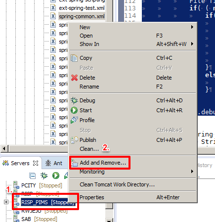

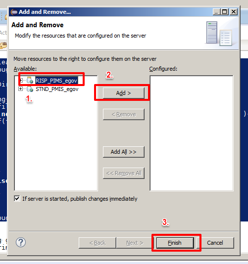

4. Web Module Settings
------------------------------

By default the root context will be ``/[project name]``, we need to change it to only ``/``.

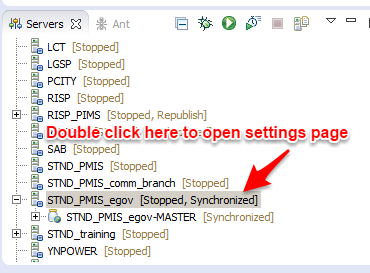

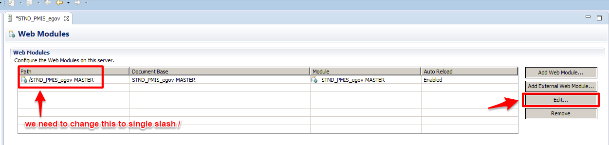

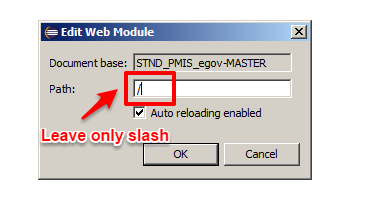

5. Compile & Run
----------------------

Compile and run the application as usual and make sure the label on the right of the server name say ``Synchronized``.

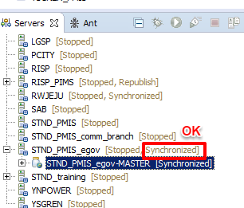

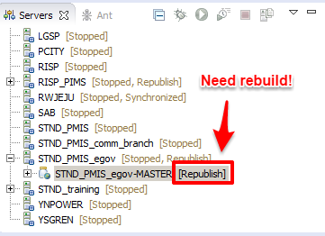