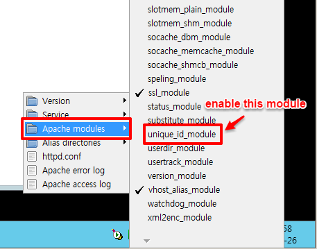

.. _windows-modsecurity-install-howto:

==============================================
Window - How to Install ModSecurity for Apache
==============================================

1. Enable ``mod_unique_id`` module
-------------------------------------

Make sure you have the ``mod_unique_id`` module installed. The module is packaged with WAMP Package for Windows.

.. figure:: _images/modsec/modsec2.png

Now the module is enabled and you can keep going.

2. Grap the source!
-----------------------

For windows go here: http://www.apachelounge.com/download/
and take the right version compatible for Apache installed on the server

Mostly we are using ``wampserver 64bit`` build with ``VC11`` for windows servers
so the right version can be found inside this package: 
http://www.apachelounge.com/download/VC11/modules/modules-2.4-win64-VC11.zip

3. Copy the files!

You need to copy ``yajl.dll`` inside the Apache ``bin`` folder.

You will find ``mod_security`` already inside ``extra-modules`` folder!

.. important:: If the folder exists just skip this step otherwise keep going.

Create a folder named ``mod_security2`` inside the ``modules`` folder of Apache

ex. ``...\apache2.4.9\modules\mod_security2``

and put inside the folder the file ``mod_security2.so``.

.. figure:: _images/modsec/modsec4.png

3. Enable the module!
---------------------------

Enable the module adding this directive to the ``httpd.conf`` file::

	#Add the following rule to load the security module.
	LoadModule security2_module modules/mod_security2/mod_security2.so

Inside the modsecurity folder there is a file named ``modsecurity.conf-recommended``
rename it as ``modsecurity.conf`` and put it inside the conf folder of Apache installation folder.

ex. here -> ``..\apache2.4.9\conf\extra``

Apache need to load this configuration file so add the following directive inside httpd.conf::

	Include conf/extra/modsecurity.conf

4. CRS Configuration
-------------------------

(https://www.modsecurity.org/CRS/Documentation/quickstart.html)

Get the archive with all the rules from here: 
https://github.com/SpiderLabs/owasp-modsecurity-crs/releases

For this tutorial I will use the version 2.2.9 taken from here:
https://github.com/SpiderLabs/owasp-modsecurity-crs/releases/tag/2.2.9

Create a folder ``activated_rules`` inside ``extra-modules\mod_security-2.8.0``
and copy inside this folder all the rules that you find here: 
http://125.141.221.126/repo/STND_PMIS_util/mod-security/pmis_rules

Rename the file ``modsecurity_crs_10_setup.conf.example`` to ``modsecurity_crs_10_setup.conf``
and copy the file inside the folder ``conf/extra``.

Create a file ``modsecurity_crs_99_whitelist.conf`` inside the ``activated_rules`` folder
if it doesn't exists already, and add the following whitelist directives at the end of the file:

Whitelisted rules -> http://125.141.221.126/repo/STND_PMIS_util/mod-security/pmis_rules.conf

Apache need to load this conf files so we need to add some directives inside ``httpd.conf``::

	IncludeOptional conf/extra/modsecurity_crs_10_setup.conf
	IncludeOptional modules/mod_security2/activated_rules/*.conf

At the end of httpd.conf file you should have the following directives::

	...

	# mod security
	# [IMPORTANT] Put this directive before the Include directives!
	LoadModule security2_module modules/mod_security2.so
	
	# Put all the Include after the LAST LoadModule directive!
	Include conf/extra/modsecurity.conf

	IncludeOptional conf/extra/modsecurity_crs_10_setup.conf
	IncludeOptional extra-modules/mod_security-2.8.0/activated_rules/*.conf
	
.. important::

	**Put all the ``Include`` directives after the LAST ``LoadModule`` directive!**

5. Turn it ON!
--------------------

ModSecurity by default is ``DetectionOnly`` in order to stop bad things happening 
we need to change the ``SecRuleEngine`` directive and turn it ``On``!

Modify the file ``modsecurity.conf`` and change the following directive::

	#SecRuleEngine DetectionOnly
	SecRuleEngine On

Restart the apache server and we have done!

6. Read the log!
----------------------

ModSecurity will write his log into the file defined from the following directive::

	SecAuditLog logs/modsec_audit.log
	
Check it and see if it block bad things!

.. note::

	Reference Manual
		https://github.com/SpiderLabs/ModSecurity/wiki/Reference-Manual